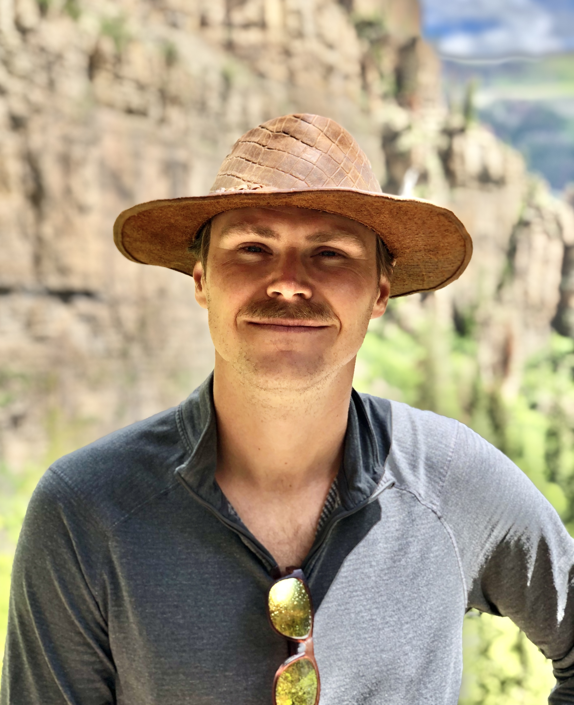

---
---

<link rel="stylesheet" href="styles.css" type="text/css">

<style type="text/css">
body{ /* Normal  */ font-size: 16px; font-family: Arial; color:black}
td {  /* Table  */ font-size: 8px;}
h1.title {font-size: 38px; color: DarkRed;}
h1 { /* Header 1 */ font-size: 28px; color: Black;}
h2 { /* Header 2 */ font-size: 22px; color: Black;}
h3 { /* Header 3 */ font-size: 18px; color: Black;}
code.r{ /* Code block */ font-size: 12px;}
pre { /* Code block - determines code spacing between lines */ font-size: 14px;}
</style>



I am a **quantitative ecologist** and **wildlife biologist** who is interested in **supporting good decisions** in natural resource management. I combine field research, quantitative methods, and  structured-decision making skills to understand system dynamics and help support wildlife management decisions in a transparent and inclusive framework. I have a B.S. in [Biological Sciences from Ohio University](https://www.ohio.edu/cas/biology) (2011), a Ph.D. in [Ecology from Auburn University](http://www.auburn.edu/cosam/departments/biology/) (2017), and post-doctoral experience from the Alabama and Florida Cooperative Fish and Wildlife Research Units at [Auburn University](https://www1.usgs.gov/coopunits/unit/Alabama) and the [University of Florida](https://wec.ifas.ufl.edu/coop/). 

I previously worked as an ecologist for the [U.S. Geological Survey](https://www.usgs.gov/) at the [Fort Collins Science Center](https://www.usgs.gov/centers/fort), where I built models and tools to support management decisions for wild horse populations in the United States. A key product I developed was [*PopEquus*](https://rconnect.usgs.gov/popequus/), a website application that can simulate wild horse populations and help understand trade-offs among management alternatives.

I currently am a Lead Scientist at [Conservation Science Partners](https://csp-inc.org). I will be working on science products to understand population dynamics and support management decisions for desert tortoises in the western United States.

On this site, you can learn about my [work interests](https://brianfolt.github.io/research), where my [projects occur](https://brianfolt.github.io/locations), and [products and publications ](https://brianfolt.github.io/publications) that have emerged from my work.

You can contact me at: brian [dot] folt [at] gmail [dot] com.

```{r pictures, echo=FALSE}
library(slickR)
paths <- c(
  
  "images/indigo.jpg",
  "images/tigris_25mar18_1a.JPG",
  "images/wild-horses-cropped.jpg",

  "images/glassfrog.jpg",
  "images/indigo-release.jpg",
  "images/toucan_27sep17_1a.jpeg",
  
  "images/bat.JPG",
  "images/grouse.jpg",
  "images/prep-tray.jpg",
      
  "images/lascruces_27sep17.jpeg",
  "images/pocket-gopher.jpg",
  "images/gopher_tortoise.jpg",
    
  "images/spider-lizard.jpg",
  "images/supraciliaris.JPG",
  "images/montanus.jpeg",

  "images/caracara_9oct17_1b.JPG",
  "images/shoal-lily.jpeg",
  "images/WL110573.jpeg",

  "images/la-sierra-class.jpg",
  "images/dinner.JPG",
  "images/cave.JPG",
  
  "images/oophaga-pumilio.jpg",
  "images/hawk.JPG",
  "images/cyrtodactylus_19aug18_1a.jpeg"

  )

slickR(obj=paths, height=175) + 
  settings(dots = TRUE, slidesToScroll=3, slidesToShow=3, 
           autoplay=TRUE, autoplaySpeed=5000,
           responsive = V8::JS(
  "[
   {
    breakpoint: 850,
  settings: {
    slidesToShow: 3,
    slidesToScroll: 3,
    infinite: true,
    dots: true
   }
  },
  {
   breakpoint: 700,
    settings: {
    slidesToShow: 2,
    slidesToScroll: 2,
    infinite: true,
    dots: true
  }
 },
 {
    breakpoint: 480,
    settings: {
    slidesToShow: 1,
     slidesToScroll: 1,
     infinite: true,
     dots: true
    }
   }
  ]"
   ))
```