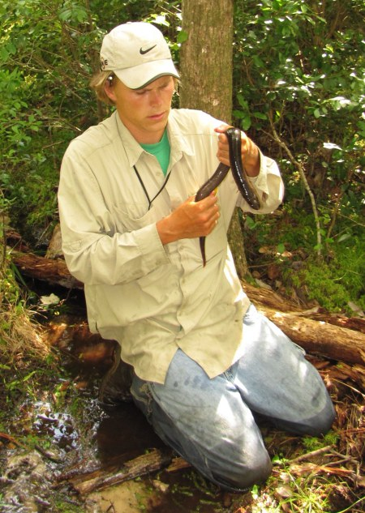
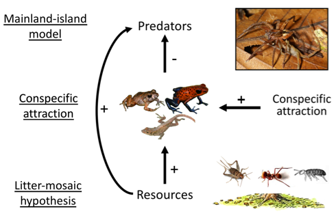
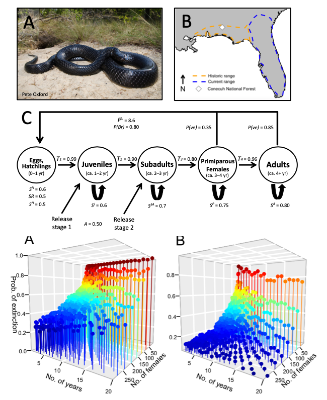

---
---

<link rel="stylesheet" href="styles.css" type="text/css">

I study animal populations from fundamental and applied perspectives. I conduct fundamental research that develops and tests hypotheses about how populations function, and then I work to understand how populations can be managed in ways that maximize important societal values, such as the preventing species extinction, maximizing ecosystem health, and reducing management cost.

However, decision makers in natural resource management often are faced with complex decisions with great uncertainty. To help navigate difficult decisions, I use decision analysis tools (e.g., structured decision making) to work with decision makers and help them understand problems, objectives, alternatives, and important trade-offs in the decision. I often build problem-solving tools and applications that, for example, use predictive models to estimate the ability of alternatives to achieve different objectives during decisions.

Click on the bold topics below to learn more about my work interests and see examples of products. I also include links to more detailed descriptions on my [ResearchGate](https://www.researchgate.net/profile/Brian_Folt) profile. Also, check out my [fieldwork](https://brianfolt.github.io/fieldwork) page for a map of study sites, pictures, and videos from the research projects in the field and lab. 

### **Population ecology**

In general, I am interested in understanding how intrinsic and extrinsic factors influence population growth and regulation of wild animal populations. For my Ph.D, I tested hypotheses describing how food resources, predators, and interspecific interactions regulated a model frog and lizard assemblage at La Selva Biological Station, Costa Rica. As a post-doc, I studied how disturbance influenced habitat structure and population dynamics of gopher tortoises. I am building an integrated population model to assess how environmental variation influences survival, reproduction, and population dynamics of 'wild horse' populations across the American West.

  - [Top-down vs. bottom-up regulation of terrestrial vertebrates](files/folt-and-guyer-2021-spiders.pdf)
  
  - [Conspecific attraction of poison frogs](https://onlinelibrary.wiley.com/doi/epdf/10.1002/ece3.3748) in tropical forests  
  
  - Bottom-up regulation of frogs and lizards (the leaf-litter mosaic model)
  
  - [Estimating demography and projecting population viability of Gopher Tortoises](files/files/folt-et-al-2021-jwm.pdf)
  
  - [Habitat-driven community assembly of glassfrogs](files/rivera-folt-2018-glassfrogs.pdf)
  
  - Environmental and management effects on population dynamics of free-roaming horses (in preparation)

### **Applied science**

I conduct research that has strong applications for wildlife management and conservation. I use field studies to understand factors influencing demographic vital rates of species, and then I build mathematical models of populations that can be used to evaluate how management alternatives influence population persistence of imperiled species, management costs, and other values-based objectives. In particular, I often study populations of imperiled vertebrates that are currently listed or being petitioned for listing under the federal Endangered Species Act (ESA), so that research can be used to support meaningful conservation decisions.

  - [Predicting population persistence of gopher tortoises will be influenced by diverse anthropogenic stressors](files/files/folt-et-al-2022-tortoise-pva.pdf)

  - [Modeling reintroduction scenarios and successes for the federally-threatened Eastern Indigo Snakes](files/folt-et-al-2019-animal-conservation.pdf)
  
  - [Population genetic structure of the federally-listed Eastern Indigo Snakes](files/folt-et-al-2019-plos-one.pdf) (<i>Drymarchon couperi</i>)
  
  - Effects of habitat fragmentation on population genetics of Gopher Tortoises (in preparation)
  
  - [*PopEquus*: a predictive modeling tool to understand tradeoffs in wild horse population management](https://rconnect.usgs.gov/popequus/)

### **Decision analysis**

Decision makers in natural resource management are faced with complex problems with multiple stakeholders, competing objectives, considerable uncertainty, and limited budgets. I am interested in helping decision makers navigate problems using values-focused decision analysis (e.g., structured decision making), facilitated meetings, and/or analytical methods to understand tradeoffs and evaluate the strength of alternatives.
  
  - [The importance of decision context in population viability analysis](files/lawson-et-al-2021-conbio.pdf)
  
  - [Multi-objective population modeling as a decision-support tool for horse population management](files/Folt-et-al-inpress.pdf)

