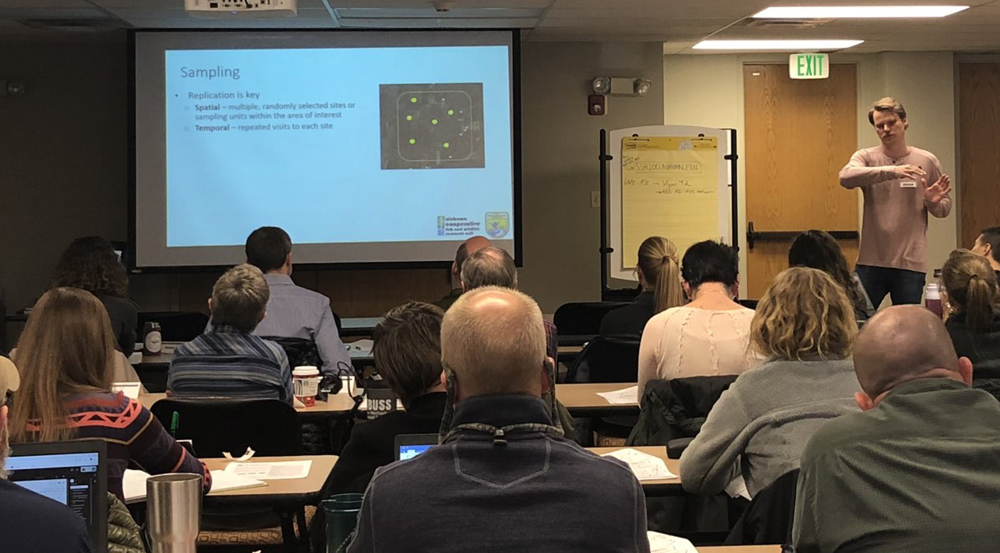
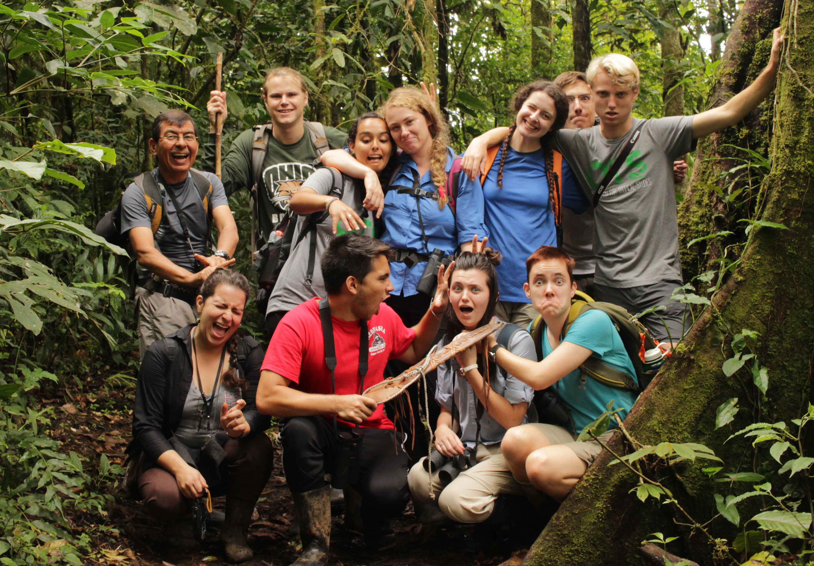
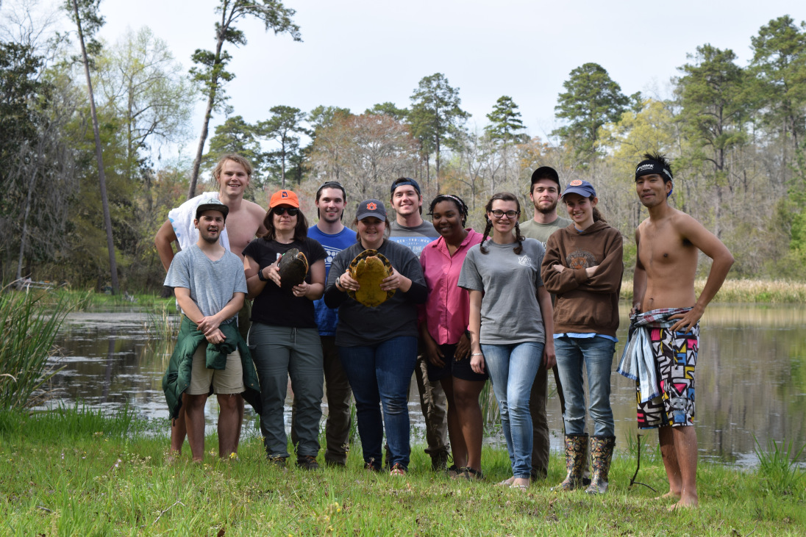

---
---

<link rel="stylesheet" href="styles.css" type="text/css">

<style type="text/css">
body{ /* Normal  */ font-size: 16px; font-family: Arial; color:black}
td {  /* Table  */ font-size: 8px;}
h1.title {font-size: 38px; color: DarkRed;}
h1 { /* Header 1 */ font-size: 28px; color: Black;}
h2 { /* Header 2 */ font-size: 22px; color: Black;}
h3 { /* Header 3 */ font-size: 18px; color: Black;}
code.r{ /* Code block */ font-size: 12px;}
pre { /* Code block - determines code spacing between lines */ font-size: 14px;}
</style>
>"<i>We will conserve only what we love, we will love only what we understand, and we will understand only what we are taught.</i>"
`r tufte::quote_footer('Baba Dioum, 1968')`



To understand and conserve wildlife on Earth, we must generate interest in nature within future generations, while also providing young scientists and professionals with the knowledge and practical skills necessary to conserve it. I work to accomplish these goals through education at multiple levels. I teach students at the collegiate level to foster student interest, provide foundational knowledge, and cultivate critical thinking skills. I also teach professional conservation practitioners from state and federal agencies the analytical skills necessary to perform risk assessments for imperiled species. Last, I engage in outreach at multiple scales to educate and increase interest in nature among the public. By fostering a strong conservation ethic through education, I believe that teaching is one of my strongest tools to not only help better understand biodiversity on Earth, but also to conserve it. 

Click on **bold links** below to drop-down information about educational formats I use to teach ecology and conservation biology.

<div class="expand collapsed" data-toggle="collapse" data-target="#college" aria-expanded="false" aria-controls="college">
<div style="background-color:rgba(0, 0, 0, 0.0470588); padding:0px 12px;">
<a style="color:black">
<font size="4"> **College Classes** </font>
</a>
</div>

<div class="collapse" id="college">
**Tropical Ecology**


In 2017, I worked as a Resident Professor for the Organization for Tropical Studies in Costa Rica, where I co-taught an undergraduate study-abroad course in tropical ecology. The course – Tropical Biology on a Changing Planet – was offered through Organization for Tropical Studies and accredited by Duke University. During a semester, the students and faculty visited six tropical forest biomes in Costa Rica and Panama, during which they become experts in ecology, environmental policy, and research methods in the diverse tropical ecosystems. They also become proficient in Spanish language and Costa Rican culture through classes at the Costa Rican Language Academy and by hanging out with all the great Costa Ricans at the field sites. Please contact me if you are interested in studying tropical biology in Costa Rica.

**Vertebrate Ecology and Herpetology**



I have taught laboratory and field courses in both Vertebrate Biodiversity and Herpetology at Auburn University. Courses introduced students to natural history, diversity, taxonomy, and anatomy of vertebrates in the southeastern United States, but herpetology provided an exhaustive focus strictly on amphibians and reptiles. Both courses included extensive field components with numerous field trips, including weekend-long experiences. The courses concluded with students conducting independent or group research projects on a species of interest, and students gave presentations on the projects.

</div>


<div class="expand collapsed" data-toggle="collapse" data-target="#ssa" aria-expanded="false" aria-controls="ssa">
<div style="background-color:rgba(0, 0, 0, 0.0470588); padding:0px 12px;">
<a style="color:black">
<font size="4"> **Risk Assessments for Endangered Species** </font>
</a>
</div>

<div class="collapse" id="ssa">

I co-taught "SSA200 - Strategic Use of Data for Species Status Assessments", a two-day crash-course in wildlife population statistics, modeling, and population projections for USFWS biologists involved in [Species Status Assessments](https://www.fws.gov/endangered/improving_esa/ssa.html). All course materials (lectures, activities, web applications, and other information) can be found on the [course website](ssa200.auburn.edu).

The International Union for the Conservation of Nature (IUCN) frequently performs assessments of whether certain species are at risk of extinction. I participated in an IUCN Red List Assessment for all [Central American freshwater turtles](https://dgcii.conabio.gob.mx/tortugas/index.html) in Mexico City, Mexico during 11-13 July 2023. I lead the assessment for the Black River Turtle (*Rhinoclemmys funerea*). [Press release](https://www.gob.mx/conabio/prensa/expertos-se-reuniran-en-mexico-para-evaluar-el-estado-de-conservacion-de-tortugas-mesoamericanas?idiom=es).

</div>

```{r pictures, echo=FALSE}
library(slickR)
paths <- c(
  
  "images/lascruces_27sep17.jpeg",
  "images/la-sierra-class.jpg",
  "images/dinner.JPG",
  
  "images/gang_11mar17_2a.jpg",
  "images/seminar-flyer.jpeg",
  "images/SSA200small.jpg"
  
  )
slickR(obj=paths, height=175) + 
  settings(dots = TRUE, slidesToScroll=3, slidesToShow=3, 
           autoplay=TRUE, autoplaySpeed=5000,
           responsive = V8::JS(
  "[
   {
    breakpoint: 850,
  settings: {
    slidesToShow: 3,
    slidesToScroll: 3,
    infinite: true,
    dots: true
   }
  },
  {
   breakpoint: 700,
    settings: {
    slidesToShow: 2,
    slidesToScroll: 2,
    infinite: true,
    dots: true
  }
 },
 {
    breakpoint: 480,
    settings: {
    slidesToShow: 1,
     slidesToScroll: 1,
     infinite: true,
     dots: true
    }
   }
  ]"
   ))
```