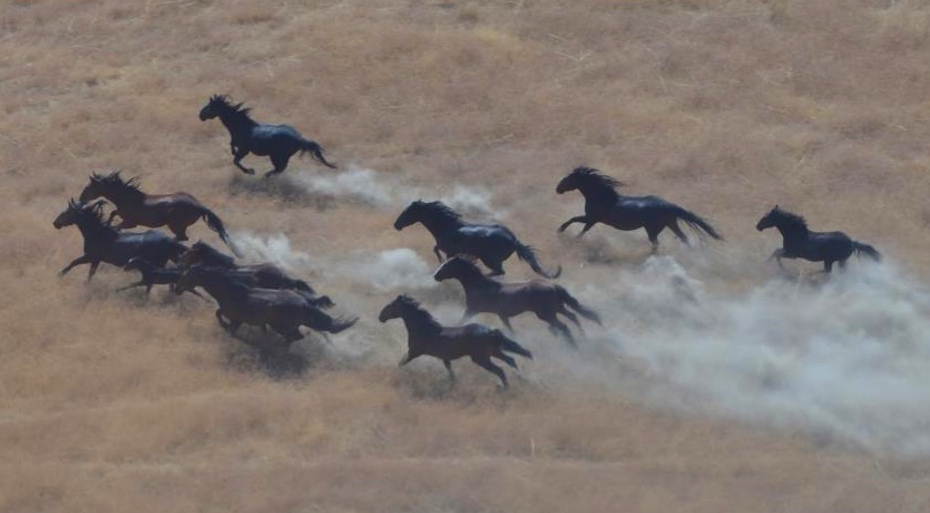

---
---

<link rel="stylesheet" href="styles.css" type="text/css">

<style type="text/css">
body{ /* Normal  */ font-size: 16px; font-family: Arial; color:black}
td {  /* Table  */ font-size: 8px;}
h1.title {font-size: 38px; color: DarkRed;}
h1 { /* Header 1 */ font-size: 28px; color: Black;}
h2 { /* Header 2 */ font-size: 22px; color: Black;}
h3 { /* Header 3 */ font-size: 18px; color: Black;}
code.r{ /* Code block */ font-size: 12px;}
pre { /* Code block - determines code spacing between lines */ font-size: 14px;}
</style>

I work to provide useful tools to wildlife managers and decision makers. Here I highlight a few decision-support tools that I have co-produced with state and federal agencies. 

# *PopEquus*



To help decision makers understand trade-offs among alternatives, I worked with staff from the BLM Wild Horse and Burro Program to co-produce [*PopEquus*](https://rconnect.usgs.gov/popequus/), an online simulation tool for wild horse population management. Users can specify features of a horse population (e.g., population growth rate) and simulate 19 management alternatives in a customizable, user-friendly interface that graphs predicted outcomes related to important metrics. *PopEquus* is being used by wildlife managers to support management decisions for populations of wild horses and burros across the West, which have important consequences for the management of many sensitive ecosystems.

# Tortoise PVA Tool


Gopher tortoises (*Gopherus polyphemus*) are an imperiled keystone species in the southeastern United States. Population viability analyses often predict that demographic vital to cause population declines and high extinction risk. However, survival rates in most models have relied on estimates of 'apparent survival' that underestimate true survival. I built a flexible [population viability analysis tool](https://brianfolt.github.io/tortoise_population_viability/) for gopher tortoises where users can specify stage-specific survival rates, maturity age, and reproductive rates and make predictions about future population trends and extinction risk. The tool can model populations that have slow growth, late maturation, and low fecundity (e.g., from Alabama) or fast-growing, early maturing, highly fecund tortoises (e.g., southern Florida). It is slow to load. It is slow to load.


```{r pictuures, echo=FALSE}
library(slickR)
paths <- c(

  "images/jwm-cover.jpg",
  "images/copeia-cover.jpg",
  "images/ccb-cover.jpg",
  
  "images/amphibians-ohio.jpg",
  "images/reptiles-ohio.png",
  "images/ptychohyla.png",
  
  "images/structure.jpg",
  "images/indigos.jpg",
  "images/pseudotriton1.jpg"

  )
slickR(obj=paths, height=175) + 
  settings(dots = TRUE, slidesToScroll=3, slidesToShow=3, 
           autoplay=TRUE, autoplaySpeed=5000,
           responsive = V8::JS(
  "[
   {
    breakpoint: 850,
  settings: {
    slidesToShow: 3,
    slidesToScroll: 3,
    infinite: true,
    dots: true
   }
  },
  {
   breakpoint: 700,
    settings: {
    slidesToShow: 2,
    slidesToScroll: 2,
    infinite: true,
    dots: true
  }
 },
 {
    breakpoint: 480,
    settings: {
    slidesToShow: 1,
     slidesToScroll: 1,
     infinite: true,
     dots: true
    }
   }
  ]"
   ))
```